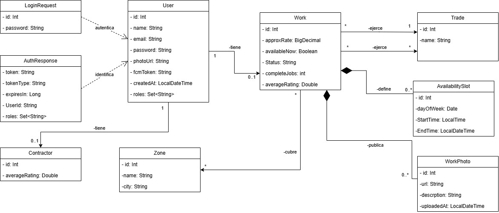

# DOSW_Lab6_Aguirre_Contreras_Gonzalez_Nieto_Moreno-

# PARTE 2 - Preguntas

## 1. ¿Para qué sirve el paquete `Controller`?

El paquete Controller contiene las clases que se encargan de recibir las solicitudes que llegan al sistema a través de HTTP. Desde aquí se definen los diferentes endpoints de la API y se determina qué operación debe realizarse según la solicitud recibida en el sistema.

Además, el controlador se comunica con la capa Service para ejecutar la lógica correspondiente y posteriormente devuelve una respuesta al cliente con el código HTTP adecuado.

---

## 2. ¿Para qué sirve el paquete `Service`?

El paquete Service contiene la lógica de negocio de la aplicación. Su función es procesar las operaciones solicitadas por los controladores y aplicar las reglas que se hayan definido para el funcionamiento del sistema.

Esta separación permite que los controladores no tengan toda la lógica de la aplicación, haciendo que el código sea más organizado y fácil de mantener.

---

## 3. ¿Para qué sirve el paquete `Model`?

El paquete Model contiene las clases que representan los principales conceptos del negocio. Estas clases permiten organizar la información que maneja la aplicación y representan los objetos que hacen parte del funcionamiento del sistema.

El modelo se enfoca principalmente en representar el dominio de la aplicación, por lo que no necesariamente tiene que estar relacionado directamente con la estructura de una base de datos.

---

## 4. ¿Para qué sirve el paquete `Repository`?

El paquete Repository se encarga de manejar el acceso a los datos de la aplicación. Es la capa que permite realizar operaciones como consultar, guardar, modificar y eliminar información cuando existe una fuente de persistencia.

En proyectos que utilizan Spring Data JPA, los repositorios facilitan estas operaciones y permiten interactuar con la base de datos sin tener que implementar manualmente todas las consultas.

---

## 5. ¿Para qué sirve el paquete `Entity`?

El paquete Entity contiene las clases que representan la información que será almacenada en la base de datos. Estas clases normalmente utilizan las anotaciones proporcionadas por JPA para establecer la relación entre los objetos de Java y las tablas de la base de datos.

Por esta razón, las entidades están relacionadas principalmente con la persistencia de la información y con la estructura que tendrá la base de datos.

---

## 6. ¿Para qué sirve el paquete `DTO`?

El paquete DTO contiene los objetos utilizados para transportar información entre las diferentes partes de la aplicación. Principalmente se utilizan para definir los datos que se reciben o se envían mediante los endpoints de la API.

Los DTO permiten controlar qué información se expone al cliente y ayudan a mantener separadas las estructuras utilizadas para la comunicación de las clases internas del sistema.

---

## 7. ¿Para qué sirve el paquete `Exception`?

El paquete Exception contiene las clases utilizadas para manejar los diferentes errores que pueden presentarse durante la ejecución de la aplicación.

También permite crear excepciones propias del proyecto y centralizar su manejo, de manera que los errores puedan convertirse en respuestas HTTP apropiadas para el cliente. Esto ayuda a mantener un manejo de errores más organizado dentro de la API.

---

# Parte 3
## Diagrama de clases

Evidencia inicial de las clases con sus atributos funcionando:

=======

# Bibliografía

Fowler, M. (2003). *Data transfer object*. Martin Fowler. https://martinfowler.com/eaaCatalog/dataTransferObject.html

Jakarta EE. (2025). *Jakarta Persistence documentation*. https://jakarta.ee/specifications/persistence/

Spring. (2026). *Spring Data JPA documentation*. https://docs.spring.io/spring-data/jpa/reference/

Spring. (2026). *Spring Framework documentation*. https://docs.spring.io/spring-framework/reference/

# PARTE 5 - Documentación del API REST con Swagger / OpenAPI

Se implementó la configuración e integración de OpenAPI 3 / Swagger UI en el proyecto Spring Boot.

A continuación se presenta la evidencia del funcionamiento interactivo de Swagger UI en `http://localhost:8080/swagger-ui/index.html`, donde se observan los endpoints documentados para los módulos de **Trabajadores** y **Autenticación**:

